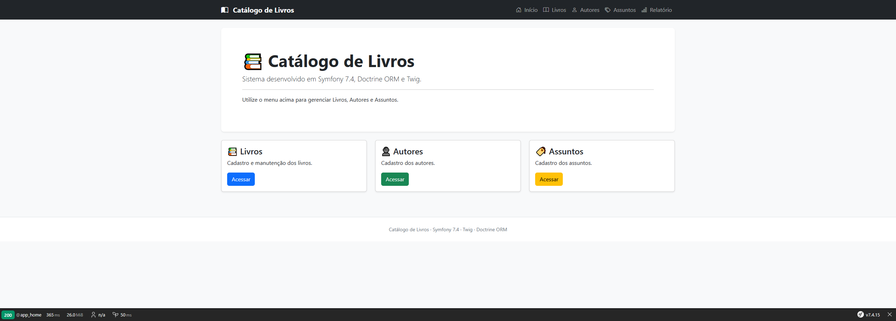
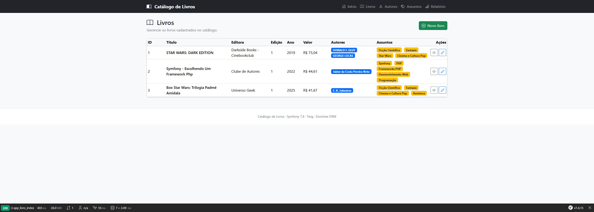
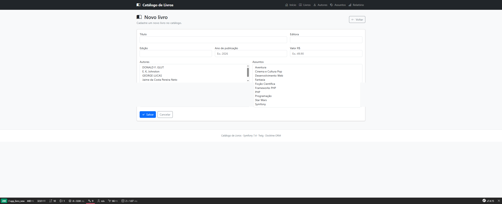
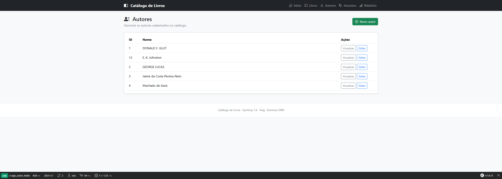
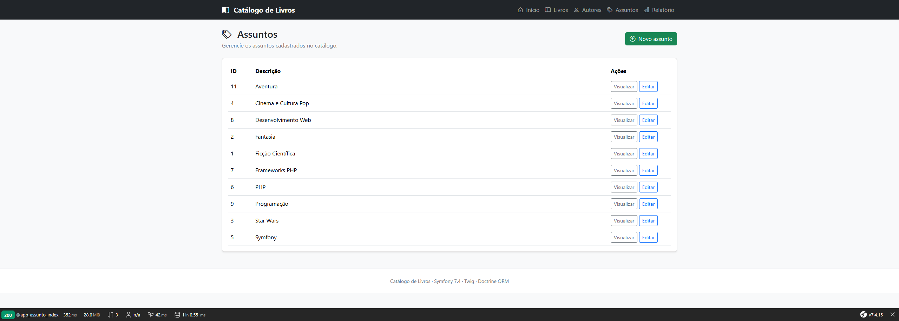
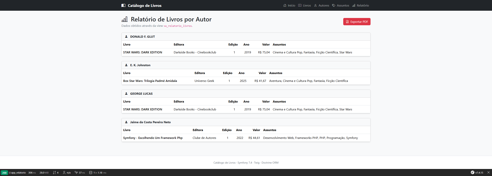

# Catálogo de Livros

Projeto desenvolvido em **Symfony 7.4** como solução para um teste técnico.

O sistema permite o gerenciamento de **Livros**, **Autores** e **Assuntos**, incluindo relacionamentos muitos-para-muitos, geração de relatório baseado em uma **VIEW** do banco de dados e exportação em PDF.

---

# Funcionalidades

- Cadastro de Livros
- Cadastro de Autores
- Cadastro de Assuntos
- Edição de registros
- Exclusão com confirmação em modal Bootstrap
- Relacionamento N:N entre Livros e Autores
- Relacionamento N:N entre Livros e Assuntos
- Relatório agrupado por Autor (VIEW SQL)
- Exportação do relatório em PDF
- Interface responsiva utilizando Bootstrap 5

---

# Telas

## Página Inicial



---

## Livros



---

## Novo Livro



---

## Autores



---

## Assuntos



---

## Relatório



---

# Tecnologias Utilizadas

- PHP 8.4
- Symfony 7.4
- Doctrine ORM
- Doctrine Migrations
- Twig
- Bootstrap 5
- Bootstrap Icons
- MySQL 8
- Dompdf
- Inputmask
- PHPUnit

---

# Requisitos

- PHP 8.4 ou superior
- Composer
- MySQL 8+
- Git

---

# Instalação

## Clonar o projeto

```bash
git clone https://github.com/landoweb/teste-tecnico-symfony-livros.git
```

Entrar na pasta do projeto.

```bash
cd teste-tecnico-symfony-livros
```

---

## Instalar as dependências

```bash
composer install
```

---

## Configurar o banco

Editar o arquivo:

```
.env
```

Alterando principalmente:

```
DATABASE_URL=
```

---

## Criar o banco

```bash
php bin/console doctrine:database:create
```

---

## Executar as migrations

```bash
php bin/console doctrine:migrations:migrate
```

Serão criados automaticamente:

- tabelas
- relacionamentos
- índices
- constraints
- VIEW utilizada pelo relatório

---

## Executar a aplicação

Utilizando o Symfony CLI:

```bash
symfony server:start
```

ou utilizando o servidor embutido do PHP:

```bash
php -S localhost:8000 -t public
```

---

# Estrutura do Projeto

```
assets/
bin/
config/
docs/
    architecture.md
    deploy.md
    database/
    screenshots/
migrations/
public/
src/
templates/
tests/
var/
vendor/
```

---

# Estrutura da Aplicação

```
src/

Controller/
Entity/
Form/
Repository/
```

### Controller

Responsável por receber as requisições HTTP, coordenar as regras da aplicação e renderizar as views.

### Entity

Representa o modelo de domínio da aplicação utilizando Doctrine ORM.

### Repository

Responsável pelas consultas ao banco de dados e pela centralização das regras de acesso aos dados.

### Form

Define os formulários utilizados para cadastro e edição das entidades.

### Templates

Views desenvolvidas utilizando Twig.

---

# Banco de Dados

O banco é criado integralmente através das migrations do Doctrine.

Opcionalmente, o diretório **docs/database** contém um banco de dados já populado (`catalogo_livros.sql`), disponibilizado apenas para facilitar a demonstração da aplicação.

A forma recomendada de instalação continua sendo através das migrations do Doctrine.

Entidades principais:

- Livro
- Autor
- Assunto

Relacionamentos:

```
Livro
    |
    | N:N
    |
Autor

Livro
    |
    | N:N
    |
Assunto
```

Também foram adicionados índices e restrições de unicidade para evitar registros duplicados em **Autores** e **Assuntos**.

---

# Relatório

O relatório utiliza a VIEW:

```
vw_relatorio_livros
```

A VIEW retorna:

- Autor
- Livro
- Editora
- Edição
- Ano de publicação
- Valor
- Assuntos

permitindo o agrupamento dos livros por autor.

O script SQL encontra-se em:

```
docs/database/view_relatorio_livros.sql
```

O diretório **docs/database** também contém o arquivo:

```
catalogo_livros.sql
```

utilizado apenas como banco de demonstração para agilizar a avaliação da aplicação.

Também é possível exportar o relatório em PDF.

---

# Tratamento de Exceções

Os cadastros de **Autor** e **Assunto** possuem tratamento específico para:

- UniqueConstraintViolationException
- DBALException
- Throwable

Além disso, a aplicação registra eventos importantes utilizando o componente **PSR-3 Logger** do Symfony.

---

# Interface

A interface foi construída utilizando Bootstrap 5.

Recursos implementados:

- Layout responsivo
- Flash Messages
- Modais Bootstrap para confirmação de exclusão
- Máscara monetária utilizando Inputmask
- Bootstrap Icons

---

# Testes

O projeto possui testes unitários implementados utilizando **PHPUnit**, cobrindo as principais regras das entidades da aplicação.

Atualmente a suíte contempla:

- **Autor**
- **Assunto**
- **Livro**

Total da suíte:

- **21 testes**
- **36 assertions**

Os testes encontram-se no diretório:

```
tests/
```

Para executá-los:

```bash
php bin/phpunit
```

Resultado esperado:

```
PHPUnit 13.x

.....................

OK (21 tests, 36 assertions)
```

---

# Diferenciais Implementados

- Doctrine ORM
- Doctrine Migrations
- Twig
- Bootstrap 5
- Bootstrap Icons
- Dompdf
- Inputmask para formatação monetária
- Relatório baseado em VIEW SQL
- Relacionamentos Many-to-Many
- Tratamento estruturado de exceções
- Logs utilizando PSR-3 Logger
- Modais Bootstrap para confirmação de exclusão
- Organização em camadas (Controller, Entity, Repository e Form)
- Testes unitários utilizando PHPUnit

---

# Decisões Técnicas

Durante o desenvolvimento foram adotadas algumas decisões visando simplicidade, organização e boas práticas:

- utilização de relacionamentos **Many-to-Many** para Autores e Assuntos;
- utilização de **ON DELETE CASCADE** apenas nas tabelas intermediárias;
- tratamento específico para exceções de banco de dados e registros duplicados;
- utilização do **Doctrine QueryBuilder** como padrão para consultas mais elaboradas;
- documentação de exemplos de paginação e filtros nos Repositories, sem implementação por se tratar de um teste técnico;
- utilização do **Inputmask** apenas para apresentação do valor monetário, mantendo o armazenamento no formato nativo do banco;
- utilização de Bootstrap Modals para confirmação de exclusão, proporcionando melhor experiência ao usuário.

---

# Melhorias Futuras

- Pesquisa por título
- Filtros por autor e assunto
- Paginação
- Ordenação dinâmica
- Upload de capa do livro
- Autenticação de usuários

---

# Autor

**Orlando Stefanin Epifânio**

Desenvolvido como solução para teste técnico utilizando **Symfony 7.4**, **Doctrine ORM**, **Twig** e **Bootstrap 5**.

---

**Obrigado pela avaliação do projeto.**